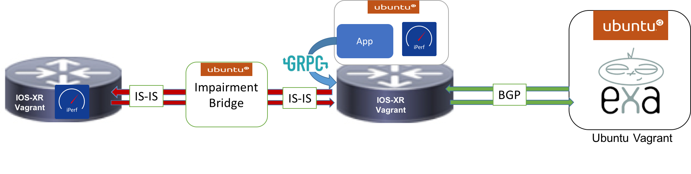

# Pipedown-Vagrant
##### Vagrant for Pipedown
##### Author: Karthik Kumaravel & Lisa Roach
##### Contact: Please use the issues page to ask questions or open bugs and feature requests.

### Overview
This environment is intended to act as a testbed for playing with Pipedown. This Vagrant uses two IOS-XRv images, two virtual box VMs, and an Ubuntu/trusty64 container on one of the IOS-XRv images. The plumbing and demo functions are brought up through bash scripts to allow you to use the Router-Connectedness application without hassle, and demo it to others.



### Set Up

To install the application.

Step 1. Set up Virtualbox and Vagrant on your device

Step 2. Clone this repo

Step 3. Download the IOS-XRv vagrant box through the following link:

&nbsp;&nbsp;&nbsp;&nbsp;Download: https://xrdocs.github.io/getting-started/steps-download-iosxr-vagrant

And follow the instructions to add the base box:

&nbsp;&nbsp;&nbsp;&nbsp;Instructions: https://xrdocs.github.io/application-hosting/tutorials/iosxr-vagrant-quickstart

Step 4. We want to allow a Nat Network for internet throughout the environment. You only need to do this one as a setup.

Onetime config command:

``` VBoxManage natnetwork add --netname Internet --network "13.0.2.0/24" --enable --dhcp off ```

Step 5. In a terminal screen change directory into the repository.

``` cd vagrant ```

Step 6. ``` vagrant up ```

This is all you need to get Pipedown working! It will take a few minutes, and you will see a number of ugly looking messages like these:

```
==> xrv: tar: dev/audio2: Cannot mknod: Operation not permitted
==> xrv: tar: dev/sequencer: Cannot mknod: Operation not permitted
==> xrv: tar: dev/midi3: Cannot mknod: Operation not permitted
==> xrv: tar: dev/mixer3: Cannot mknod: Operation not permitted
==> xrv: tar: dev/smpte3: Cannot mknod: Operation not permitted
==> xrv: tar: dev/mpu401data: Cannot mknod: Operation not permitted
```

But don't worry, your vagrant boxes are working perfectly. Once you see the following message you wil know you are done:

```
==> xrv: Machine 'xrv' has a post `vagrant up` message. This is a message
==> xrv: from the creator of the Vagrantfile, and not from Vagrant itself:
==> xrv:
==> xrv:
==> xrv:     Welcome to the IOS XRv (64-bit) VirtualBox.
...
```
### How to use this demo

All commands below originate from the vagrant folder.

#### Running the application

After completing the initial ```vagrant up```, the container is already running with the application. If you navigate to

```ssh - p 58822 ubuntu@localhost```

Here you will see the repository with a proper config. To run the application a simple.

``` python monitor_daemon.py ```

#### Impair the Link

1. Jump into the bridge vagrant:

   ```vagrant ssh bridge```

2. Run the start_impair script:

   ``` ./start_impair.sh ```


#### Repair the Link

1. Jump into the bridge vagrant:

   ``` vagrant ssh bridge ```

2. Run the stop_impair script:

   ``` ./stop_impair.sh ```

#### Checking the CLI

You can check if the application changed the policy in rtr2 cli.

``` vagrant port rtr2 ```

All the port forwardign for rtr2 will be displayed, we want to use the one for 22.

``` ssh -p [port forwarding for 22] vagrant@localhost ```

The password is vagrant

Example:

<div class="highlighter-rouge">
<pre class="highlight">
<code>
KKUMARA3-M-T2G0:vagrant kkumara3$ <mark>vagrant port rtr2</mark>
The forwarded ports for the machine are listed below. Please note that
these values may differ from values configured in the Vagrantfile if the
provider supports automatic port collision detection and resolution.

    <mark>22 (guest) => 2202 (host)</mark>
 57722 (guest) => 2201 (host)
 58822 (guest) => 58822 (host)
KKUMARA3-M-T2G0:vagrant kkumara3$ <mark>ssh -p 2202 vagrant@localhost</mark>
vagrant@localhost's password:


RP/0/RP0/CPU0:rtr2#
</code>
</pre>
</div>

#### Debugging

If you need to check iPerf here are some helpful commands.

Run iPerf Server on rtr1:
``` iperf -s -B 10.1.1.2 -u ```


Test iPerf client on rtr2:
```iperf -c 10.1.1.2 -B 10.1.1.1 -t 10 -i 10 -u -y C```

